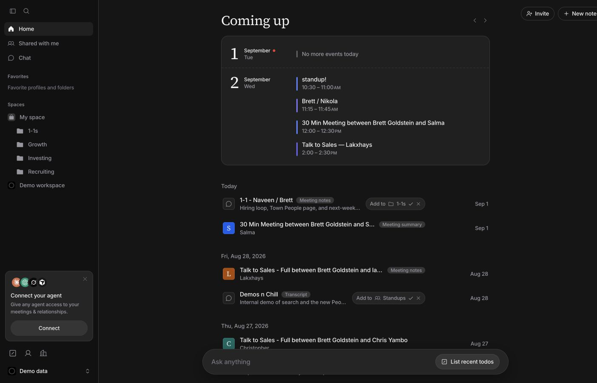

# Granola UI

**Your relationships, notes, and meetings in a Granola-inspired workspace.**

A self-hosted interface powered by [Micro](https://micro.so). Bring your own API keys, connect your workspace, and browse your people, companies, and activity in one place.

[Quick start](#quick-start) · [Connect your workspace](#connect-your-workspace) · [Contributing](#contributing) · [MIT license](https://github.com/micro-so/granola-ui/blob/HEAD/LICENSE)



*Upcoming meetings and past meeting notes with bundled demo data. No live workspace data is shown.*

## Features

- **People and companies:** Browse directories, open profiles, and explore relationship history.
- **Notes and activity:** Find notes, tasks, and activity alongside the people and companies they belong to.
- **Workspace lists:** Bring your Micro lists into the sidebar for quick access.
- **Meetings:** View your upcoming calendar events and optionally connect Granola notes and folders.
- **Your own workspace:** Configure your display name and credentials, or explore the demo without an account.

Built with Next.js, React, TypeScript, Tailwind CSS, and the Micro SDK. This is an experimental project inspired by Granola, not an official Granola product. Some controls are UI previews; see [what stays local](#what-is-shared-and-what-stays-local).

## Quick start

Install Node.js 20.9 or later and npm, then:

```bash
git clone https://github.com/micro-so/granola-ui.git
cd granola-ui
npm ci
cp .env.example .env.local
npm run dev
```

Open [localhost:3001](http://localhost:3001). Without Micro credentials, the app opens demo data.

## Connect your workspace

1. Create an API key in the [Micro developer console](https://app.micro.so/console). Get the corresponding workspace's team ID from Micro or your workspace administrator. The key must have access to that team.
2. Open `.env.local` in your editor and fill in:

   ```dotenv
   MICRO_API_KEY=your_api_key
   MICRO_TEAM_ID=your_team_id
   MICRO_WORKSPACE_NAME="Your workspace name"
   MICRO_ME_EMAIL=you@example.com
   ```

3. Restart the server after changing settings. Stop it with Ctrl+C, then run `npm run dev` again.

New browsers open live data when both Micro credentials are present. The bottom-left menu switches between **Demo data** and your workspace and remembers your choice. If you previously selected demo data, choose your workspace there after adding keys.

The workspace name is the display name you enter, not an automatically fetched name. It appears in the sidebar, list parent choices, and sharing labels. Your email identifies your calendar and filters your own identity in meeting views; without it, the calendar asks you to configure it.

## Connect your agent

Click **Connect** in the sidebar’s **Connect your agent** card, then **Copy prompt**. Paste it into your coding agent to set up the Micro SDK. The prompt covers local credentials and a read-only connection check; it contains no API keys. An agent that cannot run code can guide you through the local steps.

## Optional connections

- **Granola:** Set `GRANOLA_API_KEY` to your own Granola API key to load its notes and folders. Micro people and companies do not require it.
- **Custom Micro server:** Set `MICRO_BASE_URL` only if you use a different API endpoint. Otherwise leave it blank.
- **Local email and iMessage fixtures:** `LOCAL_EMAIL_ACTIVITY_PATH` and `LOCAL_IMESSAGE_ACTIVITY_PATH` point to optional JSON fixture files. The app also checks `.local/email-activity.json` and `.local/imessage-activity.json` when these settings are blank. These are local fixtures, not live inbox connections. A fresh clone contains neither file.

## What is shared and what stays local

Each running copy uses one configured workspace and one set of server credentials. Keys stay on the server; only the workspace display name and default data mode are passed to the browser. Keep keys in `.env.local`; never prefix them with `NEXT_PUBLIC_`.

Live profile edits, deletions, and other supported writes affect the connected workspace. Use a test workspace when experimenting. Demo data is a UI preview, not a security boundary for the app's API routes.

Some UI preferences and folder settings are saved only in the browser. Folder sharing labels do not enforce access permissions. This is a prototype, and not every visible control has a complete backend integration.

`.env.local` and `.local/` are ignored by Git. Share the repository, not your local directory with credentials or private fixtures included. When switching accounts on the same browser and address, clear the site's browser storage to reset saved preferences.

## Running and sharing

```bash
npm run dev     # Local development, http://localhost:3001
npm run lint    # Lint the source
npm run build   # Production build
npm start       # Run the production build locally
```

Both server commands bind to `127.0.0.1` by default, so they are accessible only on your computer.

This app has no built-in sign-in or per-user authorization. Before hosting it for other people, add access protection covering both pages and `/api/*` routes. Anyone who can reach an unprotected server can use its configured credentials to read or change workspace data. A shared deployment is not a way for visitors to connect their own keys; give each person their own local installation instead.

## Troubleshooting

- **Still seeing demo data:** Choose your workspace in the bottom-left menu. Confirm both Micro settings are filled in and restart the server.
- **Credentials or permission errors:** Check that the API key is valid and has access to `MICRO_TEAM_ID`. An empty workspace can legitimately show empty lists.
- **Calendar asks for an email:** Set `MICRO_ME_EMAIL` to the address connected to your calendar in Micro and restart.
- **No Granola notes:** Check your optional Granola key and its access. Without it, Granola-specific content is unavailable.
- **Port 3001 is already in use:** Stop the other server or run `npm run dev -- --port 3002`, then open localhost on that port.
- **Dependency install fails:** Check `node --version` (20.9 or later) and retry `npm ci` from the repository folder.

## Contributing

Bug reports and focused pull requests are welcome. See [CONTRIBUTING.md](CONTRIBUTING.md) for local setup, checks, and what to include in a contribution.

## License

[MIT](https://github.com/micro-so/granola-ui/blob/HEAD/LICENSE). Product names and logos belong to their respective owners.
